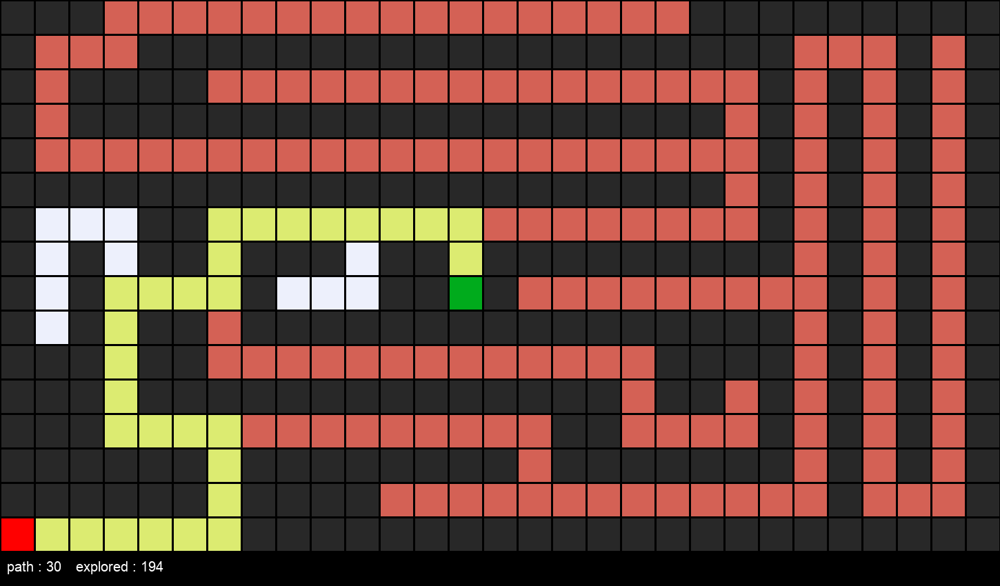
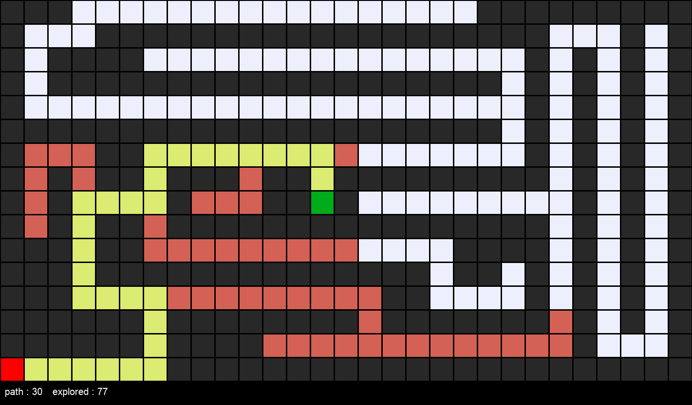
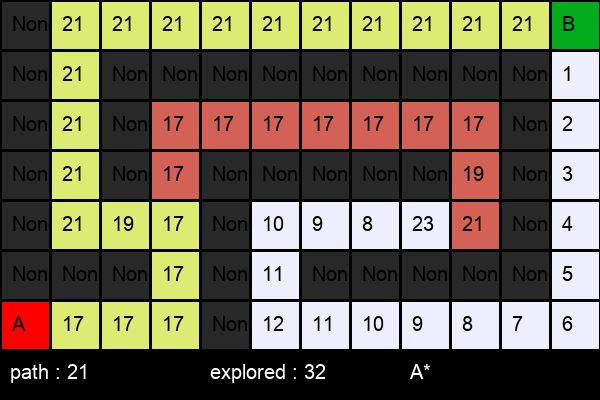

# 🔍 Search in AI  

This project demonstrates the implementation of various **AI Search Algorithms** with visualizations on a maze/grid. The goal is to explore classical search strategies in Artificial Intelligence and compare their performance.  

---

## 📂 Features  

- **Uninformed Search Algorithms**  
  - Depth First Search (DFS)  
  - Breadth First Search (BFS)  

- **Informed Search Algorithms**  
  - Greedy Best First Search (GBFS)  
  - A* Search Algorithm  

- **Adversarial Search Algorithms**  
  - Minimax Algorithm  
  - Alpha-Beta Pruning  

---

## 📸 Visualizations  

Maze search progress and results are stored in the `assets/` folder.  


### DFS Search  
  

### BFS Search  
  

### Greedy Best First Search  
  

### A* Search  
  

#### Minimax Example  
  

#### Alpha-Beta Pruning Example  
  

---

## 🛠️ Tech Stack  

- **Language:** Python 🐍  
- **Libraries:**  
  - `PIL (Pillow)` – for images  
  - `collections` – for queues & stacks  
  - `heapq` – for priority queue (A*, GBFS) 
  - `tkinter` - for game ui 

---

## 🚀 Getting Started  

### 1. Clone the Repository  
```bash
git clone https://github.com/your-username/search-in-ai.git
cd search-in-ai
```
### 2. 🏃 How to Use

Run each algorithm individually on a maze text file:

#### Depth First Search
```py
python3 dfs.py maze1.txt
```
#### Breadth First Search
```py
python3 bfs.py maze1.txt
```
#### Greedy Best First Search
```py
python3 gbsf.py maze1.txt
```
#### A* Search
```py
python3 astar.py maze1.txt
```
#### Minimax (for games)
```py
python3 minimax.py
```
#### Alpha-Beta Pruning (for games)
```py
python3 alphabeta.py
```
- Replace maze1.txt with your maze file.
